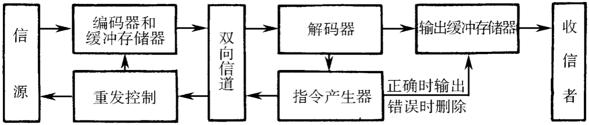

###### 11-1 在通信系统中采用差错控制的目的是什么？

为了降低误码率，提高可靠性。

###### 11-2 什么是随机信道？什么是突发信道？什么是混合信道？

随机信道：错码的出现是随机的，错码之间是统计独立的。
突发信道：错码是成串集中出现的，即在一些短促的时间段内会出现大量错码。
混合信道：既存在随机错码又存在突发错码的信道。

###### 11-3 常用的差错控制方法有哪些？试比较其优缺点。

* 前向纠错FEC：发端发送能纠错的码，收端能够检错并纠错，无需反馈信道。既能检错又能纠错，实时性好，但冗余度高，有效性低，设备复杂。
  反馈重传ARQ（检错重发）：收端一旦检出错，则通知发端重传，直到正确接收为止。可以检错但不能纠错。
* 混合差错控制HEC：以上两种的结合，纠错能力之内，则自动纠正，否则重传。
* 信息反馈IRQ（反馈校验）：收端将信息原封不动转发回发端，与原发送信码比较。若不同，则认为有错，发端立即重发。原理和设备都很简单，但需要双向信道，传输效率也较低。
* 检错删除：在接收端发现错码后，立即将其删除，不要求重发。只适用于在少数特定系统中（发送码元中有大量多余度，删除部分接收码元不影响应用），接收端有少量损失但实时性好。

###### 11-4 画出 ARQ 系统的组成方框图，并试述该系统的优缺点。

* 优点：监督码元较少就能使误码率降到很低，即码率较高；检错的计算复杂度较低；检错用的编码方法和加性干扰的统计特性基本无关，能适应不同特性的信道。
* 缺点：需要双向信道重发，从而导致传输效率降低。干扰严重时甚至会因不断重传导致通信中断，所以不适用于实时场合。不适用于单向信道和一点到多点的通信系统。

###### 11-5 什么是分组码？其构成有何特点？

将信息码分组，为每组信息码附加若干监督码的编码称为分组码。
分组码一般用（n，k）表示，n为码组总位数，k为信息位位数，n-k=r为监督码元位数。

###### 11-6 试述码率、码重和码距的定义。

码率：信息位数与总码元位数之比，k / n 。
码重：码组中“1”的个数。
码距：两个码组对应位上数字不同的位数。

###### 11-7 一种编码的最小码距与其检错和纠错能力有什么关系？

记码距为 d0 ，纠错码的个数为 t ，检错码的个数为 e ，则
d0 >= e + 1
d0 >= 2t + 1
d0 >= t + e + 1 (e>t)

###### 11-8 什么是奇偶监督码？其检错能力如何？

（1）奇偶监督码分为奇数监督码和偶数监督码。偶数监督码是指监督位只有一位，目监督位使码组中“］”的数目为偶数的监督码；奇数监督码是指监督位只有一位，且监督位使码组中“1”的个数为奇数的监督码。

（2）奇偶监督码的检错能力：

偶数监督码的检错能力按照（a(n-1)+a(n-2)+...+a0=0 求“模2和”， 若计算结果为“1”就说明存在错码，若为“0”就认为无错码。

奇数监督码的检错能力：按照（ a(n-1)+a(n-2)+...+a0=1 求“模2和”， 其纠错能力与偶数监督码的一样。

###### 11-9 什么是线性码？它具有哪些重要性质？

（1）定义：信息位和监督位是由一些线性代数方程联系着的码称为线性码。

（2）性质：封闭性，即一种线性码中的任意两个码组之和仍为这种码组中的一个码组。

###### 11-10 什么是循环码？循环码的生成多项式如何确定？

答：（1）一个码组循环一位（即将最右端的一个码元移至左端，或反之）以后，仍为该码中的一个码组的码称为循环码。

（2）循环码的生成多项式的确定：由

xⁿ+1=g(x)［ xᴷ+h(x)］可知，生成多项式g（x）为（xⁿ+1） 的一个因子。

###### 11-11 什么是系统分组码？并举例说明之。

答：（1）由典型生成矩阵得出的码组，其信息位不变，监督位附加于其后。这种形式的码称为系统分组码。

（2）例如，（7，3）循环码编码器有4级移位寄存器，它们分别用a、b、C、d表示。此外，还有一个双刀双掷开关S。当信息位输入时，开关S 倒向下，输入信息位一方面送入除法器进行运算，另一方面直接输出。在信息位全部进入除法器后，开关倒向上，这时输出端接到移位寄存器，将其中存储的除法运算余项依次取出，同时断开反馈线。用这种方法编出的码组中，前面是原来的k个（现在是3个）信息位，后面是（n-k）个（现在是4个）监督位。因此它是系统分组码。

###### 11-12 何谓截短循环码？它适用在什么场合？

答：（1）设给定一个（n，k）循环码，它共有2种码组，现使其前i（0<i<k）个信息位全为“0”，于是它变成仅有 2K-1种码组。然后从中删去这i位全“0”的信息位，最终得到一个（n-i,k-i）的线性码。将这种码称为截短循环码。

（2）在设计纠错方案时，常常信息位数k、码长 n和纠错能力都是预先给定的。但是，并不一定有恰好满足这些条件的循环码存在。这时，可以采用将码长截短的方法，得出满足要求的编码

###### 11-13 什么是BCH码？什么是本原 BCH 码？什么是非本原BCH码？

（1）BCH码是指一种获得广泛应用的能够纠正多个错码的循环码。

（2）本原BCH码是指生成多项式g（x）中含有最高次数为m 的本原多项式，且码长为n=2ᵐ-1（m>13，为正整数）的BCH码。

（3）非本原 BCH 码是指生成多项式中不含这种本原多项式，且码长n是（2ᵐ-1）的一个因子，即码长 n一定除得尽 2ᵐ-1的BCH码。

###### 11-14 循环码、BCH 码和 RS 码之间有什么关系？

* BCH码是循环码的一种扩展，而RS码是BCH码的一种特例。因此，RS码也可以被看作是一种特殊的BCH码。

   - RS码通常用于需要高纠错能力的应用，例如卫星通信、磁盘存储等。而BCH码作为一种更一般的循环码扩展，可以在需要较小纠错能力的场景中使用。

###### 11-15 卷积码和分组码之间有何异同点？卷积码是否为线性码？

**卷积码（Convolutional Code）：**

1. **编码特点：** 卷积码是通过对输入数据进行卷积操作而得到输出码字的一类码。在卷积编码中，每个输出比特都是由输入比特及其前一些输入比特的线性组合生成的。

2. **时域特性：** 卷积码在时域上具有内存，即输出码字不仅取决于当前输入比特，还受到之前输入比特的影响。

3. **误码性能：** 卷积码通常在无记忆信道（memoryless channel）中表现较好，特别适用于通信中的深度信道。

4. **解码：** 卷积码的解码通常使用译码器，例如 Viterbi 解码器。

**分组码（Block Code）：**

1. **编码特点：** 分组码是将输入数据按照固定的块（分组）进行编码，即每个块被映射到一个固定长度的码字。
2. **时域特性：** 分组码在时域上是无记忆的，每个块的编码只与当前块的信息有关。
3. **误码性能：** 分组码在一些情况下可以通过增加纠错能力来提高误码性能。
4. **解码：** 分组码的解码通常使用纠错码的译码器，例如 BCH 码、RS 码等。

* 卷积码是线性码。线性码是指码字之间的任意线性组合仍然是码字的编码系统。卷积码在编码过程中使用线性移位寄存器和线性组合操作，因此满足线性码的定义。

###### 11-16 卷积码适合用于纠正哪类错码？

卷积码通常适用于纠正随机错误，尤其是在通信系统中的深度信道中表现良好。这包括传输过程中由于信道噪声、干扰和其他随机因素引起的比特错误。

###### 11-17 试述 Turbo 码和链接码的异同点。

1. **相似点：**
   - **串联结构：** Turbo码和链接码都采用了串联结构，即将多个纠错码连接在一起，以提高整体纠错性能。
   - **迭代解码：** 两者都采用了迭代解码的思想，即通过多次迭代传递信息来提高解码性能。
2. **异同点：**
   - **设计思路：**
     - **Turbo码：** Turbo码采用了两个相同或相似的分量码（通常是递归系统码）进行串联，然后通过迭代的方式进行交互解码。
     - **链接码：** 链接码一般指采用串行或并行连接不同种类的纠错码，例如串联卷积码和 BCH 码，或串联卷积码和 RS 码等。
   - **结构特点：**
     - **Turbo码：** Turbo码通常由两个编码器和一个交织器组成，解码器采用迭代译码算法，例如迭代译码算法（MAP）。
     - **链接码：** 链接码的结构可以更加灵活，可以串联不同种类的纠错码，通过选择不同的分量码进行设计。
   - **应用领域：**
     - **Turbo码：** Turbo码主要用于无线通信、卫星通信和数字广播等领域，尤其在移动通信标准中得到了广泛应用，如3G、4G等。
     - **链接码：** 链接码在卫星通信、光通信和存储系统中有一些应用，它们可以通过串联不同种类的码来实现更灵活的纠错性能。

###### 11-18 LDPC码的全称是什么？

LDPC码的全称是“低密度奇偶校验码”（Low-Density Parity-Check Code）。也被称为图码（Graph Code）

###### 11-19 何谓 TCM？其中文全称是什么？TCM 中的网格图和卷积码的网格图有何不同？为什么？

**TCM的全称是 Trellis-Coded Modulation，中文翻译为“格码调制”**。

**不同之处：**
1. **图的含义：**
   - **TCM中的网格图：** 表示调制和编码的状态转移，展示不同输入符号和相应输出符号的关系。
   - **卷积码的网格图：** 表示编码器内的状态转移，显示每个时刻输入比特和输出比特之间的关系。

2. **用途：**
   - **TCM中的网格图：** 主要用于展示格码调制的过程，其中格码调制结合了调制和编码的过程。
   - **卷积码的网格图：** 主要用于描述卷积编码的状态演变，其中卷积编码是一种特殊的编码方式。

3. **结构：**
   - **TCM中的网格图：** 可能包含多个层次，每个层次代表不同的格码调制状态。
   - **卷积码的网格图：** 主要描述编码器内的状态转移，通常是一个单层的图。

**为什么不同？**
- TCM和卷积码虽然在图论上都使用了网格图，但它们的设计目的和应用场景不同。TCM主要用于描述格码调制，将调制和编码结合在一起，而卷积码的网格图主要用于描述卷积编码器内的状态转移，着重于编码过程。因此，尽管图形表示上有相似之处，但实际上它们反映了不同的概念和设计思想。

###### 11-20 何谓自由欧几里得距离？为什么需要引入这个概念？

自由欧几里得距离（Free Euclidean Distance）是指在码空间中两个不同的码字之间的最小欧几里得距离，即在没有考虑任何约束的情况下，两个码字之间的最短直线距离。

在通信和编码理论中，自由欧几里得距离是一种用于衡量线性块码（如汉明码、BCH码、RS码等）性能的指标。它是码空间中最小的距离，可以用来评估纠错码的纠错能力。如果自由欧几里得距离较大，说明码字之间的差异较大，编码器在纠正错误时有更大的余地。

引入自由欧几里得距离的原因包括：

1. **纠错性能：** 自由欧几里得距离直接影响纠错能力。通常情况下，纠错能力越强，码字之间的自由欧几里得距离越大。

2. **最小距离：** 自由欧几里得距离是码空间中最小的距离，也是最小汉明距离的一种补充。最小距离越大，纠错性能越好。

3. **码空间分析：** 通过分析码空间中码字的分布，可以更好地了解编码的性能和潜在的纠错能力。

自由欧几里得距离通常与最小汉明距离一同用于评估纠错码的性能。最小汉明距离是指码空间中任意两个不同码字之间的最小汉明距离。这两个指标共同为设计和选择纠错码提供了有用的信息。