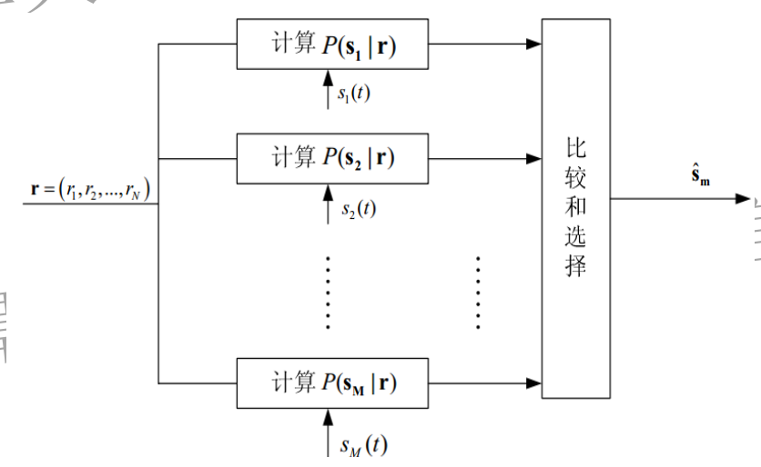
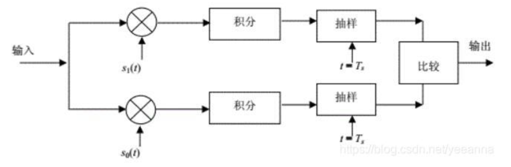

###### 9-1 试问数字信号的最佳接收以什么指标作为准则？

差错概率最小准则和输出信噪比最大准则，其中差错概率最小准则用于设计最佳接收机，输出信噪比最大准则用于设计匹配滤波器。

###### 9-2 试写出二进制信号的最佳接收的判决准则。

最大似然准则

若 𝑓₀ 𝒓 > 𝑓₁ 𝒓 ，则判为“0”——s₀ 𝑡

若 𝑓₀ 𝒓 ≤ 𝑓₁ 𝒓，则判为“1”——s₀ 𝑡

###### 9-3 对于二进制双极性信号，试问最佳接收判决门限值应该等于多少？

等概条件下，判决门限为零。

###### 9 -4 试问二进制确知信号的最佳形式是什么？

双极性信号，两种码元波形相反，相关系数最小，即 ρ = -1。

###### 9-5 试画出二进制确知信号最佳接收机的方框图。

###### 9-6 对于二进制等概率双极性信号，试写出其最佳接收的总误码率表示式。

Pℯ= 1/2 [1- erf(√(E𝘣/n₀))] = 1/2 erfc(√(E𝘣/n₀))

###### 9-7 试述数字信号传输系统的误码率和信号波形的关系。

当两信号相同时，ρ = 1，此时误码率最大，为 1 / 2 ；

当两信号波形相反时， ρ = -1，此时误码率最小。

###### 9-8 何谓匹配滤波？试问匹配滤波器的冲激响应和信号波形有何关系？其传输函数和信号频谱又有什么关系？

用线性滤波器对接收信号滤波时，使抽样时刻上线性滤波器的输出信噪比最大就是匹配滤波。当 K 取一时，匹配滤波器的冲击响应信号是输入信号沿 y 轴镜像折叠后再向右平移T得到，其中 T 大于等于输入信号宽度。
传输函数等于信号码元频谱的复共轭（除常数因子外）。

###### 9-9 试述滤波器的物理可实现性条件。

接收滤波器输入端的信号码元在抽样时刻 t0 之后必须为零。

###### 9-10 试问如何才能使普通接收机的误码率达到最佳接收机的水平？

使普通接收机的信噪比等于最佳接收机的码元能量和噪声功率谱密度之比（或答使普通接收机带宽等于码元传输速率）。

###### 9-11 何谓相关接收？试画出接收2FSK 信号的相关接收方框图。

相关接收是将输入信号与参考信号进行相关运算，然后再进行抽样判决比较的数字信号接收形式。

###### 9-12 试比较相关接收和匹配滤波的异同点。试问在什么条件下两者能够给出相同的输出信噪比？

* 相同点：都是最佳接收方法。
* 不同点：匹配滤波的输出是输入信号与输入信号的镜像再向右平移t0的卷积运算，相关接收的输出是输入信号的自相关函数。
* 在抽样时刻两者的输出信噪比相同。

###### 9-13 对于理想信道，试问最佳基带传输系统的发送滤波器和接收滤波器特性之间有什么关系？

二者相等，是H(f)的1/2次幂。