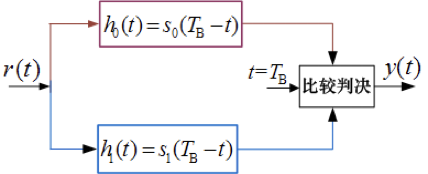

##### 一、选择题（每小题1 分，共10分）

###### 八进制数字信号的传码率是1200B，则传信率为（ A）；如果传信率不变，则四进制传码率为 （A ）。

A．3600b/s，1800B  B．1600b/s，1800B  C．36000b/s，2400B D．4800b/s，1800B

###### 窄带高斯噪声的包络服从（ C）分布，其正交分量则服从（ C ）分布。

A.瑞利  瑞利   B. 高斯  均匀   C.瑞利  高斯   D.莱斯  瑞利

###### 恒参信道传输特性的不理想会引起信号的（C ）失真和（ C）失真。

A．高频，低频  B．幅频，相频  C．低频，相位  D．码间，频率

###### 单音100%调制AM信号的最大信噪比增益约是（ A），SSB的信噪比增益是（A ）。

A．2，1    B．2/3，1     C．2/3，2        D．1/9，2

###### 下列对数字基带码型描述错误的是（B）。

A. AMI码的功率谱不含直流成分  B.CMI码是一种双极性二电平码

C. HDB3码可以解决连零问题    D. 归零码的带宽比非归零码的带宽小

###### 以下说法正确的是（A）

A. 4DPSK信号的矢量图中，每个比特被映射成一个相位

B. 4DPSK中双比特码元选择相位时，使用的是相位的绝对值

C. 4PSK信号的矢量图中，每种相位对应1比特信息

D. 4DPSK信号的生成可以先对双比特码元进行码变换，然后再按照4PSK信号的相位映射关系实现

###### 对于二进制确知信号的最佳接收，使ρ=1的最佳信号形式是（D）

A. 2FSK信号  B. 2ASK信号    C. 单极性基带信号    D. 2PSK信号

###### 某PCM通信系统采用A律13折线编码，设最小量化间隔为1个量化单位∆ ，则最大量化间隔为（D）

A．32∆   B．16∆   C．4∆    D．64∆

###### 线性分组码的最小汉明距为5，则最多可检测（C ）位错，或者纠正（C）位错。

A．6，2     B．5，4     C．4，2       D．5，3

###### 同步系统中用于相干解调的是（C ）同步，用于抽样判决的是（C ）同步。

A．高频，位    B．群，码元    C．载波，码元    D．群，帧

##### 二、填空题（每小题2 分，共24分）

信源编码是降低信号中信息冗余度的编码，目的是提高通信系统的 _效率_ ；信道编码是增加信号中信息冗余度的编码，目的是提高通信系统的  _可靠性_。

某16进制数字传输系统每隔1ms传输一个码元，则信息传输速率是    。

​			R=1000×4=4000 bit/s

一个均值为0，方差为𝞭²的窄带平稳高斯随机过程，其同相分量为  高斯随机  随机过程，均值为 0  ，方差为 𝞭²/2 。

已知输入抽样脉冲值为-748Δ，采用A律13折线PCM编码，则此时编码器的输出码组为  01100111  ，量化误差为 0.5  。

设m(t)为低通信号，最高频率为fʜ，按照抽样定理的抽样速率抽样，如果均匀量化量化电平数为M，则采用二进制代码的PCM最小码元速率为 2fʜlog2M   波特。

在数字通信系统中，接收端采用均衡器的目的是 **抵消信道的失真**   ，衡量均衡器均衡效果的两个准则是 **均方误差** 和 **误码率**。

某调相波信号S(t)=4cos[10⁸πt + 8cos(10⁸πt)]，则已调信号功率为 8 W ，调相灵敏度 KP为 1 时的调制信号为 m(t)=8cos(10⁸πt) V，调制指数为 8 ，信号带宽为 900 MHz 。

数字信号频带传输系统中，采用差分移相键控的主要目的是为克服恢复载波的 倒π 问题。

某八进制数字通信系统的误码率为10⁻⁵，信息速率为6 kbit/s，则码元速率为 2000 Baud，接收端在 100 秒内总共约能收到 2 个错误码元。

连续信道容量与 信道带宽 、 信号功率 、 噪声功率谱密度 三个因素有关。

数字通信系统中，同步包括 载波同步 、 位同步 、 帧同步/群同步 和网同步。

在小信噪比的情形下，AM包络检波可能存在 门限 效应，即输出信噪比不按输入信噪比线性变化，而是急剧恶化。

##### 三、简答题（每小题5 分，共15分）

###### 已知信息代码为：100000000111001000010，试就AMI码、HDB3两种情形给出编码结果，并说明HDB3码相对于AMI码的优点。

* AMI码：-100000000+1-1+100-10000+10    （1.5分）

* HDB3码：-1000-V+B00+V+1-1+100-1000-V10    （1.5分）

* HDB3码相对AMI码的优点是将“0”码限制在3个以内，使得接收时能保证定时信息的提取。（2分）

###### 简述什么是匹配滤波器？它的基本准则是什么？并画出二进制信号的匹配滤波接收机的系统结构图。

匹配滤波器的传递函数与信号频谱的复共轭成正比（或冲击响应镜像平移）

准则：在某一特定时刻的输出信噪比最大

系统结构图如下

###### AM信号的波形和频谱有哪些特点？

（1）AM信号的波形特点：AM波的包络与调制信号的形状完全一样。

（2）AM信号的频谱特点： 

① AM信号的频谱有载频分量、上边带和下边带三部分组成；

② 上边带的频谱结构和原调制信号的频率结构相同，下边带是上边带的镜像

③ 带宽是基带信号带宽的2倍。

